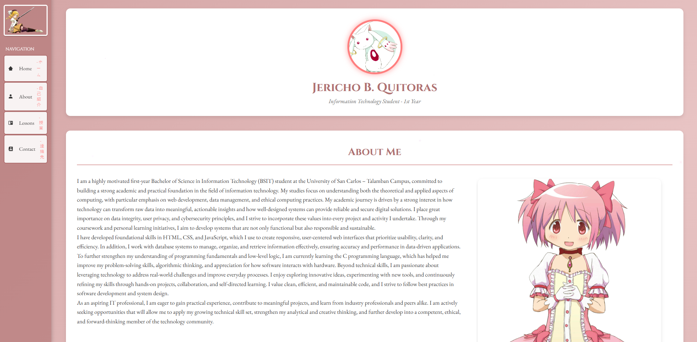

# Jericho B. Quitoras - Portfolio Website

A magical, anime-themed portfolio website inspired by *Puella Magi Madoka Magica*, featuring stunning visual effects, character showcases, and comprehensive lesson summaries for Introduction to Computing coursework.



## 🌟 Features

### Landing Page (`index.html`)
- **Interactive Hero Section** with magical particle effects
- **Soul Gem Button** - Click to enter the portfolio with a beautiful Madokami transition
- **Character Showcase Sections** featuring:
  - Ultimate Madoka (Madoka Kaname)
  - Homulilly (Homura Akemi - Witch Form)
  - Mami Tomoe (Veteran Magical Girl)
  - Sayaka Miki (Knight of Justice)
  - Kyoko Sakura (Spear of Rebellion)
- **Seamless Gradient Transitions** between character themes
- **Starfield Background** with twinkling animation
- **Footer Section** with social links and contact information

### Portfolio Page (`portfolio.html`)
- **Magical Start Screen** featuring Ultimate Madoka with particle effects
- **Madokami Entrance Transition** - Epic zoom and fade effect when entering from landing page
- **Sidebar Navigation** with Japanese translations and magical symbols
- **About Me Section** with clickable Madoka image linking to manga
- **14 Lesson Cards** with magical hover effects and particle emissions
- **Contact Section** with university information and social media links
- **Mami Button** - Return to landing page functionality

### Visual Effects
- **Magical Particle System** - Mouse-following particles on canvas
- **Shimmer Effects** - Animated shimmer waves on content boxes
- **Floating Background Particles** - Ambient magical atmosphere
- **Hover Animations** - Glowing effects, scaling, and particle emissions
- **Smooth Transitions** - Between all pages and sections

### 14 Computing Lessons
Comprehensive 300-500 word essays covering:
1. Data, Information, and Knowledge
2. Artificial Intelligence & Cybersecurity
3. Computer Systems in Healthcare
4. Vending Machine Algorithm (with pseudocode)
5. Number Systems Conversion (Binary & Hexadecimal)
6. General vs. Specific Purpose Software
7. IPOS System Components
8. Utility Applications Overview
9. Student Information Database
10. Network Topologies
11. IT Ethics & Data Privacy
12. HTML Personal Webpage Structure
13. CSS Style Sheet
14. Generative AI Impact

## 🎨 Design & Aesthetics

### Color Palette
- **Primary Pink**: `#ff0088` - Magical girl pink
- **Light Pink**: `#ffb3d9` - Soft accents
- **Purple**: `#a300a3` - Deep magical purple
- **Lavender**: `#f7a3ff` - Light magical glow
- **Rose Gradient**: `#d4a5a5` to `#e8c4c4` - Background gradient

### Typography
- **Cinzel** - Used for titles and headings (magical, epic feel)
- **EB Garamond** - Used for body text (readable, elegant serif)

### Theme Inspirations
Each character section features unique color gradients:
- **Madoka**: Pink gradient (hope)
- **Homura**: Purple-black gradient (time/despair)
- **Mami**: Golden-yellow gradient (elegance)
- **Sayaka**: Blue gradient (justice)
- **Kyoko**: Red gradient (rebellion)

## 📁 Project Structure

```
portfolio/
├── index.html                  # Landing page
├── portfolio.html              # Main portfolio page
├── style-landing.css           # Landing page styles
├── style.css                   # Portfolio page styles
├── main-landing.js             # Landing page JavaScript
├── main.js                     # Portfolio page JavaScript
├── images/
│   ├── madokami-full.png       # Ultimate Madoka
│   ├── homura-witch.png        # Homura witch form
│   ├── mami-action.png         # Mami combat
│   ├── sayaka-peace.png        # Sayaka
│   ├── kyoko-spear.png         # Kyoko
│   ├── soul-gem.png            # Soul gem button
│   ├── Profile_Pic.png         # Profile photo
│   ├── Mami Top_Nav Bar.png    # Sidebar Mami
│   ├── madoka-full_main.png    # About section Madoka
│   ├── symbol-lessons.jpg      # Lesson card icons
│   └── madoka-bg-hero.png      # Hero background
└── lessons/
    ├── lesson1-page.html       # Data, Information, Knowledge
    ├── lesson2-page.html       # AI & Cybersecurity
    ├── lesson3-page.html       # Healthcare Systems
    ├── lesson4-page.html       # Vending Machine Algorithm
    ├── lesson5-page.html       # Number Systems
    ├── lesson6-page.html       # Software Types
    ├── lesson7-page.html       # IPOS Components
    ├── lesson8-page.html       # Utility Applications
    ├── lesson9-page.html       # Student Database
    ├── lesson10-page.html      # Network Topologies
    ├── lesson11-page.html      # IT Ethics
    ├── lesson12-page.html      # HTML Basics
    ├── lesson13-page.html      # CSS Basics
    └── lesson14-page.html      # Generative AI
```

## 🚀 Getting Started

### Prerequisites
- Modern web browser (Chrome, Firefox, Safari, Edge)
- No build tools required - pure HTML, CSS, and JavaScript

### Installation

1. **Clone or download the repository**
   ```bash
   git clone https://github.com/yourusername/portfolio.git
   cd portfolio
   ```

2. **Ensure all files are in the correct structure** (see Project Structure above)

3. **Open `index.html` in your browser**
   - Simply double-click `index.html`
   - Or use a local server:
     ```bash
     # Python 3
     python -m http.server 8000
     
     # Node.js (with http-server)
     npx http-server
     ```

4. **Navigate the site**
   - Landing page loads automatically
   - Click the **Soul Gem** to enter portfolio
   - Explore character sections by scrolling
   - View lessons from portfolio page
   - Return to landing via **Mami button** in sidebar

## 🎮 Interactive Features

### Landing Page
- **Mouse Movement**: Creates magical particle trails on hero section
- **Soul Gem Click**: Triggers epic Madokami transition to portfolio
- **Character Hover**: Sparkle effects on character images
- **Scroll Navigation**: Smooth scrolling between character sections

### Portfolio Page
- **Start Screen**: Click anywhere on Madokami to enter portfolio
- **Lesson Cards**: Hover to see magical particle emissions
- **About Image**: Click Madoka to visit manga on MangaDex
- **Sidebar Navigation**: Smooth scroll to sections
- **Content Boxes**: Automatic shimmer effects on scroll into view

## 🛠️ Technologies Used

- **HTML5** - Semantic markup
- **CSS3** - Advanced animations, gradients, effects
- **Vanilla JavaScript** - No frameworks, pure JS
- **Canvas API** - Particle system rendering
- **Intersection Observer API** - Scroll-based animations
- **Web Animations API** - Smooth transitions
- **Google Fonts** - Cinzel & EB Garamond
- **Boxicons** - Icon library

## 📱 Responsive Design

- **Desktop**: Full experience with all effects
- **Tablet**: Adapted layouts, maintained effects
- **Mobile**: Simplified navigation, optimized performance
- Breakpoints at 1024px, 768px, and 480px

## ♿ Accessibility Features

- **Semantic HTML** - Proper heading hierarchy
- **ARIA Labels** - Screen reader support
- **Keyboard Navigation** - Full keyboard accessibility
- **Focus Indicators** - Clear focus states
- **Alt Text** - Descriptive image alternatives
- **Color Contrast** - WCAG compliant ratios

## 🌐 Browser Support

- ✅ Chrome 90+
- ✅ Firefox 88+
- ✅ Safari 14+
- ✅ Edge 90+
- ⚠️ IE11 - Not supported (uses modern CSS/JS features)

## 📝 License

This project is created for educational purposes as part of coursework at the **University of San Carlos - Talamban Campus**.

**Anime/Character Assets**: All *Puella Magi Madoka Magica* characters and imagery are © Magica Quartet/Aniplex. Used for educational/fan purposes only.

## 👤 Author

**Jericho B. Quitoras**
- Email: echoquitoras@email.com
- Phone: +63 945 395 6679
- University: University of San Carlos - Talamban Campus
- Course: BS Information Technology (BSIT) - 1st Year

### Social Links
- [Facebook](https://www.facebook.com/jericho.quitoras)
- [Instagram](https://www.instagram.com/jiriko_q/)
- [Twitter](https://x.com/ExpiredF1s74070)
- [LinkedIn](https://www.linkedin.com/in/jericho-quitoras-335666308/)

## 🎓 Academic Context

This portfolio was created as part of the **Introduction to Computing** course requirements, demonstrating:
- Web development skills (HTML, CSS, JavaScript)
- Understanding of computing concepts
- Creative design and UI/UX principles
- Technical writing and documentation
- Project organization and version control

## 🙏 Acknowledgments

- **Magica Quartet** - For creating *Puella Magi Madoka Magica*
- **University of San Carlos** - For educational support
- **Google Fonts** - For beautiful typography
- **Boxicons** - For icon library
- **MangaDex** - For hosting the manga reference

## 📈 Future Enhancements

- [ ] Add more interactive animations
- [ ] Implement dark/light theme toggle
- [ ] Add loading animations
- [ ] Create blog section for tech articles
- [ ] Add project showcase beyond lessons
- [ ] Implement contact form with backend
- [ ] Add i18n for Japanese translations
- [ ] Performance optimizations for mobile

## 🐛 Known Issues

- Particle effects may impact performance on older devices
- Some animations disabled on mobile for performance
- Canvas effects require hardware acceleration

## 📞 Support

For questions, issues, or feedback:
- Email: echoquitoras@email.com
- Open an issue on GitHub
- Contact via social media links above

---

**Made with 💖 and ✨ magical girl aesthetics**

*"Even if you can't see her, she's always watching over you. Madoka became something larger than a person to stop the sadness. And she will continue to watch over you forever."*

--- 

⭐ **Star this repository if you found it helpful!**
